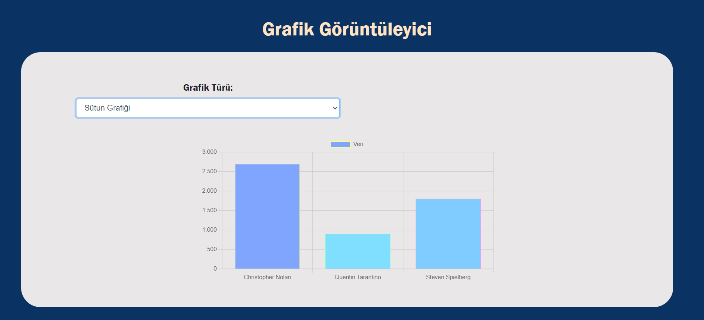
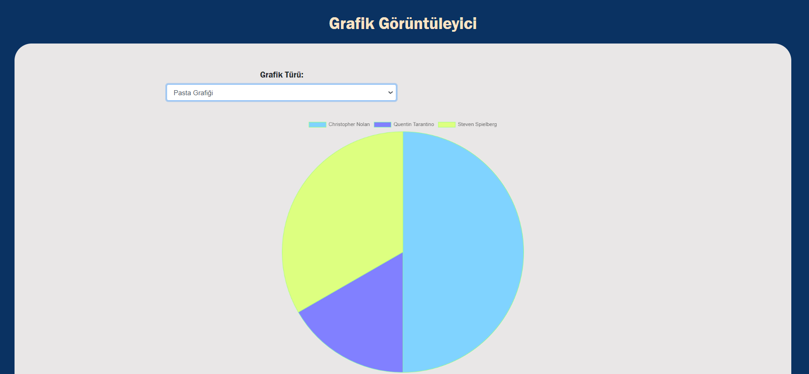
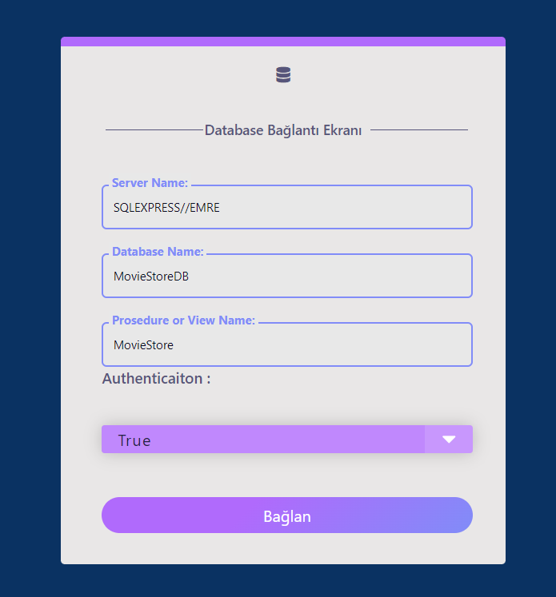
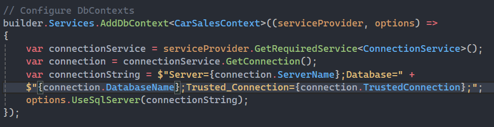
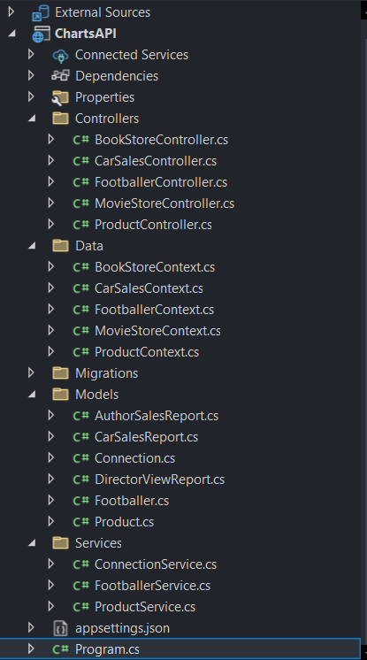

# Introduction
# **Dinamik Grafik Görselleştirme Web Uygulaması**

Bu proje yapmaya çalıştığım, kullanıcıların çeşitli grafik türlerini ve veri kaynaklarını seçerek dinamik bir şekilde grafikler oluşturmasına olanak tanıyan bir web uygulamasıdır. Amaç, kullanıcıların farklı veritabanı görünümleri (views ve stored procedures) arasında seçim yaparak, bu verileri farklı grafik türleri ile görselleştirebilmesidir. Chart.js kütüphanesi ile grafikler oluşturulurken, bu grafikler bir web sitesi aracılığıyla göstermeye çalıştım.

## **İçindekiler**

- [Özellikler](#özellikler)
- [Teknolojiler](#teknolojiler)
- [Database](#database)
- [Kurulum](#kurulum)
- [Kullanım](#kullanım)


## **Özellikler**

- **Dinamik Grafik Seçimi:** Kullanıcılar sütun, donut, radar, pasta gibi grafik türleri arasında seçim yapabilir.
- **API'den Veri Çekme:** Farklı veritabanlarından gelen veriler dinamik olarak grafiklere yansıtılır. Veritabanı bilgilerini kullanıcı elle girmelidir


## Teknolojiler
- **HTML :**  Uygulamanın yapısal içeriğini oluşturmak için kullanıldı. Web sayfasının temel iskeletini oluşturdu.
- **CSS :**  Sayfanın tasarımını ve stilini belirlemek için kullanıldı.
- **JavaScript :** Sayfanın dinamik işlevselliğini ve veri yönetimini sağlamak için kullanıldı. Kullanıcının seçimlerine göre grafikleri günceller.
- **Chart.js :** Grafik oluşturma kütüphanesi olarak kullanıldı. Seçilen veri kaynağı ve grafik türüne göre dinamik grafikler oluşturuldu.
- **Bootstrap :** Responsive bir kullanıcı arayüzü sağlamak için kullanıldı. Farklı ekran boyutlarına uygun bi tasarım.
- **.NET Web Api :** Bu projede Api sisteminin çalışması için .NET Web Api kullanılmıştır.
- ** MSSQL :** Projenin veritabanı için ise .NET sistemiyle daha rahat çalışabilmek için MSSQL kullanıldı. Veritabanı görünümü için ise View ve Stored Procedure yapısı kullanıldı.

## Database
-**BookStore Database :** Kitapların veritabanından alınarak grafiklerde gösterilmesini sağlaar.
-**MovideStore Database :**Filmlere ilişkin verileri sağlar ve bu verilerin grafiklerde kullanılması için API ile iletişim kuraar.
-**CarSales Database :**Araba satış verilerini sağlar ve bu verilerin grafiklerle görselleştirilmesini sağladı.
-**Footballer Database :** Futbolcu isimlerini ve atılan gol sayısını tutar ve grafiklerle görselleştirilmesini prosedür ile sağlar
-**Product Database :** Ürün isimlerini ve ücretini tutar ve grafiklerle görselleştirilmesini prosedür ile sağlar

## Kütüphaneler
- **Charts.js :** Web uygulaması içinde dinamik grafikler oluşturmak için kullanılan popüler bir JavaScript kütüphanesidir. Farklı grafik türleri (sütun, pasta, radar vs.) arasında kolayca geçiş yapılmasını sağlar ve kullanıcı etkileşimlerine uygun grafikler oluşturur.
-- **Bootsrtrap :** CSS kütüphanesi olarak kullanılır ve responsive tasarımın temelini oluşturur. Web sayfasının farklı cihazlarda ve ekran boyutlarında tutarlı bir görünüme sahip olmasını sağlar. Ayrıca, çeşitli hazır bileşenler ve stiller sunarak geliştirme sürecini hızlandırır.

### **Gereksinimler**

- Bir web tarayıcısı (Chrome, Firefox, vs.)
- Node.js ve npm (isteğe bağlı, geliştirme ve paket yönetimi için)

### **Proje Dosyalarını İndirme**

Proje dosyalarını indirip klonlayın:

```bash
git clone https://github.com/veyselemreyemlik/ChartsWebApi
cd ChartsWebApi

### **Uygulama Görselleri**





